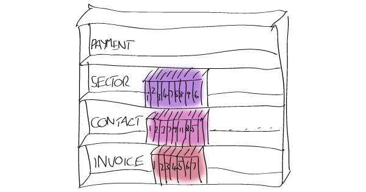
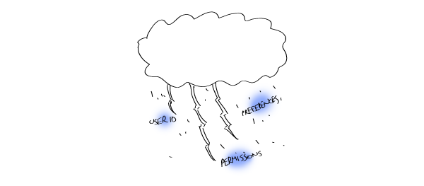

# The M and C in MVC

React only provides the V in MVC --<br>
The part which would usually be state free.

But state is inherent to any app.<br>
And storing it in component state is kind of crap.

So what is a React dev to do?<br>
Create a Model and Controller to go with the View!

<br>


<small>@james_k_nelson</small>

---

## A somewhat contrived example

We want to display some invoices.

--

- **We'll store them with Redux**

  *So we'll inject them with `connect`*

--

- **We have 10,000 invoices**

  *So we'll need to virtualize the list*

--

- **Our scrollbars generate a `limit` and `offset`**

  *Which we'll store with component `state`*

???

# Show of hands: Who uses Redux? `connect`?

---

## Let's write some code

```javascript
class InvoiceListContainer extends Component {
  state = {
    limit: 20,
    offset: 0,
  }
  
  render() {
    return <InvoiceList {...this.props} />
  }
}
```

--

```javascript
connect((state, props) => ({
  invoices: selectInvoices(
    state,
    props.offset,
    props.limit
  )
}))
```

???

But how do we combine the two?

---

## The Problem

`connect` cannot access any of the state in containers which it wraps.

<div class="box">
  <div class="box-label"><code>connect</code> Higher Order Component</div>
  <div class="box">
    <div class="box-label">Container</div>
    <div class="box">
      <div class="box-label">Presentational Component</div>
    </div>
  </div>
</div>

---

## Why use `setState` at all?

Can't our view state just be stored with Redux?

--

- Multiple container instances

--

- Allows partial updates

--

- Only renders a single subtree

---

## So let's move the state *outside* of `connect`

```javascript
const ConnectedInvoiceList =
  connect((state, props) => ({
    invoices: selectInvoices(
      state,
      props.offset,
      props.limit
    )
  }))(InvoiceList)

class InvoiceListContainer extends Component {
  state = {
    limit: 20,
    offset: 0,
  }
  
  render() {
    return <ConnectedInvoiceList {...state} />
  }
}
```

---

## So let's move the state *outside* of `connect`

<div class="box">
  <div class="box-label">Wrapper Container Component</div>
  <div class="box">
    <div class="box-label"><code>connect</code> Higher Order Component</div>
    <div class="box">
      <div class="box-label">Presentational Component</div>
    </div>
  </div>
</div>

???

## 1. Now our state can be passed to `connect` via props!

## 2. That solves our problem, except...

---

## But what if we want to *fetch* invoices?

We'll need the output of `connect`

--

- We don't have all data - it's paginated

--

- We probably have some data

--

- We don't know if we have data or not until we check

---

## What does "checking" look like?

```javascript
componentWillMount() {
  if (needToFetch(this.props.invoices)) {
    this.props.dispatch(
      Actions.FetchInvoices(
        this.props.offset,
        this.props.limit
      )
    )

  }
}
```

---

## But where do we put it?

--

- `dispatch` needs to go in a Container

--

- `InvoiceListContainer` doesn't have injected data

--

- So we need another container

---

## Wrap a Container which Renders a Connector which...

<div class="box">
  <div class="box-label">Wrapper Container Component</div>
  <div class="box">
    <div class="box-label"><code>connect</code> Higher Order Component</div>
    <div class="box">
      <div class="box-label">Inner Container Component</div>
      <div class="box">
        <div class="box-label">Presentational Component</div>
      </div>
    </div>
  </div>
</div>

???

## We've now got a component called `InvoiceListContainerWrapper` which renders a component called `ConnectedInvoiceListContainer` which wraps a class called `InvoiceListContainer` which renders a class called `InvoiceList`.

## This is terribly ugly. But let's pretend we're Java Developers and can deal with it. Its still horrible, because:

---

## Render and then render again

`dispatch` jumps back to `connect`.

--

**Render flow**

1. Wrapper Container
2. Connector
3. Inner Container
  * `dispatch`!
4. Connector *(again!)*
5. Inner Container *(again!)*

???

## 1. This isn't going to take a huge amount of time

## 2. But imagine you've got a form which updates outer state on each keypress.

## 3. Now every mounted `connect` gets re-rendered on each keypress

## 4. And everything inside it!

## 5. And each layer make things worse

---

## But you'd never really have *that* many layers, right?

Names changed at the request of the API (it is a little shy)

```javascript
@connect((state, props) => ({
  invoices: selectInvoices(state, props)
}))
@connect((state, props) => ({
  contacts: selectContacts(state, props.invoices)
}))
class SalesforceKillerContainer extends Component {
  componentWillMount() {
    if (needToFetch(this.props.invoices)) {
      this.dispatch(Actions.FetchInvoices(this.props))
    }
    if (needToFetch(this.props.contacts)) {
      this.dispatch(Actions.FetchContacts(this.props))
    }
  }
}
```

---

## But you'd never really have *that* many layers, right?

<div class="box">
  <div class="box-label">Wrapper Container</div>
  <div class="box">
    <div class="box-label"><code>connect</code> for Invoices</div>
    <div class="box">
      <div class="box-label"><code>connect</code> for Contacts</div>
      <div class="box">
        <div class="box-label">Inner Container</div>
        <div class="box">
          <div class="box-label">Presentational Component</div>
        </div>
      </div>
    </div>
  </div>
</div>

---

## But you'd never really have *that* many layers, right?

1. Wrapper Container
2. Invoices `connect`
3. Contacts `connect`
4. Inner Container
  - Fetch invoices
5. Invoices `connect`
6. Contacts `conncet`
7. Inner Container
  - Fetch contacts
8. Contacts `connect`
9. Inner Container
10. Presentational Component

???

## 1. In an ideal world, APIs wouldn't make this necessary

## 2. We need to work with the reality, not the ideal

---

## The Problem

**Pick 2:**

1. The Container/Presentational component pattern
2. Performance
3. Composable higher-order components

---

## Controllers

Like Containers, without the Component part.

- Manage state
- Select data
- Don't render anything
- Have exclusive control of side effects
- *Wait for side effects*

???

## 0. Have more specific definition
##1. But first let's look at some examples

---

## Controllers: `connect`

`connect` is a controller under some conditions

- Only selects data
- Is not used with other HOCs
- Changes to output have no side effects

???

## 1. I told you connect leads to performance issues
## 2. Then I tell you controllers fix them
## 3. Connect is a very simple controller: see list
## 4. Clear up: I love Redux. Never mind Learn Raw React or Maxim.
## 5. Next example

---

## Controllers: `createController`

Imagine React provided a `createController` function along with `createClass`.

```javascript
const InvoiceListController = createController({
  ...
})

@control({
  invoices: InvoiceListController,
})
class InvoiceListScreen extends Component {
  // ...
}
```

---

## Controllers: `createController`

```javascript
createController({
  initialState: {
    offset: 0,
    limit: 20,
  },
  
  actions: {
    setPagination: function*(offset, limit) {
      yield this.setState({ offset, limit })
    },
  },
})
```

???

## 1. Our controller manages the state, instead of React
## 2. Our controller defines actions which the controlled components can use to update the state

---

## Controllers: `createController`

```javascript
createController({
  connect: {
    invoices: (data, requests, env, location, state) =>
      selectInvoices(
        data, requests, state.offset, state.limit
      ),
  },
  
  controllerWillReceiveData: function*(prev, next) {
    if (needToFetch(next.invoices)) {
      yield this.dispatch(
        Actions.FetchInvoices(
          this.state.offset, this.state.limit
        )
      )
    }
  },
})
```

???

## 1. But what are the generators? I'll cover later
## 2. And what are these funny arguments for the `connect` functions?
## 3. This talk is about two things...

---

## The Model

The controller manages your state, the model is the state.

And the model has 5 types of state:

- data
- communication
- control
- environment
- location

---

## Data state

- Has your business objects
- Objects have type and id
- Global
- Matches your server's data (at some point in time)
- Stored with Redux (or something similar)

<p style='text-align: center'></p>

---

## Data state

```javascript
{
  invoices: {
    "123": {
      name: "Invoice 123",
      ...
    }
  }
}
```

???

## 1. Forms are not data state
## 2. Whether you're fetching or not is not data state

---

## Communication state

Communication state is the status of any not-yet-complete requests to other services.

- Global
- Changes when a request starts or completes
- Stored with Redux (or something similar)

<p style='text-align: center'></p>

---

## Communication state

```javascript
{
  requestNumber: 1,
  selector: { type: 'Invoice' },
  operation: null,
  error: null,
}
```

---

## Communication state

```javascript
{
  requestNumber: 2,
  selector: {
    type: 'Invoice',
    id: '123'
  },
  operation: {
    type: 'Create',
    value: { name: "Acme Inc.", /* ... */ },
  },
  error: { type: 'UnknownError' },
}
```

This info can be combined with the data state to produce an object with *state*: creating, deleting, retrieving, fresh, etc.

???

## Show of hands: Who has ever written setState({ fetching: true })?
## 1. With this info, you don't have to.
## 2. You could even write optimistic updates
## 3. Or an app wide loading bar or errors component

## Final: This and Data are Global. Control state is not.

---

## Control state

The state of any controls on your page: forms, filters, orders, scrollbars, etc.

- Specific to one component
- Stored with `setState`
- Excludes information from the environment

<p style='text-align: center'></p>

---

## Environment state

Information passed in from the outside which the controller has no control over.

- E.g. `props` and `context`
- Specific to one component
- Examples:
  - id of the currently logged in user
  - id of the currently selected invoice

<p style='text-align: center'></p>

---

## Location state

The information stored in HTML5 History.

- Specific to one component tree
- Can be pulled out of react-router
- Represents the active subset of the component tree

<p style='text-align: center'></p>

---

## 2 and 5 Types of state

Global state:

- data
- communication

Container-specific state:

- control
- environment
- location

---

## Side effects are limited by state type

--

- Nothing can directly changes Data state

--

- Nothing can change its own Environment state

---

## Selecting state

Hopefully this makes more sense now:

```javascript
connect: {
  invoices: (data, requests, env, location, state) =>
    selectInvoices(
      data,
      requests,
      state.offset,
      state.limit
    ),
},
```

- `data, requests` is what we'd like to select from
- `env, location, state` gives us the info necessary to make a selection

---

## What are `env` and `location`?

This is up to you, but here are some ideas:

- `props` and `context` for `env`
- A route object from react-router for `location`

---

## Reacting to state changes

And hopefully this makes a little more sense now too:

```javascript
controllerWillReceiveData: function*(prev, next) {
  if (needToFetch(next.invoices)) {
    yield this.dispatch(
      Actions.FetchInvoices(
        this.state.offset,
        this.state.limit
      )
    )
  }
}
```

It lets us react to changes in selected data.

???

# 1. But why genertors?
# 2. First talk about side effects.

---

## Side effects

Things which happen when state changes

--

- Navigating after a POST request completes

--

- Autofilling a form field as you type

--

- Making a GET request after a GET finishes

---

## Side effects can cause infinite loops

Remember this render flow?

1. Wrapper Container
2. Connector
3. Inner Container
  * `dispatch`!
4. Connector *(again!)*
5. Inner Container *(again!)*

It could be a *lot* worse.

---

## Side effects can cause infinite loops

- Dispatch request for Invoices
- Re-render the Invoice `connect`
- Re-render the Inner Container
  * Oops, there is no data...
- Dispatch request for Invoices
- ...
- Profit?

???

## 1. Actually, I have a name for this

---

## Uncontrolled state

**Any state whose side effects can cause an infinite loop**

Examples:

- Location state which can trigger navigation

- Communication state which can trigger HTTP requests

---

## Uncontrolled state

Uncontrolled state often looks harmless

```javascript
@connect((state, props) => ({
  invoices: selectInvoices(state, props)
}))

class InvoiceListContainer extends component {
  componentWillReceiveProps(nextProps) {
    if (needToFetch(nextProps.invoices)) {
      this.props.dispatch(
        Actions.FetchInvoices(nextProps)
      )
    }
  }
}
```

???

## 1. Should this code work? Sure.
## 2. But what is part is implemented incorrectly?
## Last. Code needs to work always, so:

---

## Generators

???

## Raise of hands: who here knows what `yield` does?

--

- `yield` pauses a generator function

- `yield` can have a return value

--

```javascript
function* contrivedGenerator() {
  console.log('hello')
  let result = yield ','
  console.log(result)
}

let generator = contrivedGenerator()
const yieldedValue = generator.next()
generator.next(yieldedValue+' World!)
```

---
 
## Why use `yield`?

To unroll the loop.

```javascript
controllerWillReceiveData: function*(prev, next) {
  if (needToFetch(next.invoices)) {
    next = yield this.dispatch(
      Actions.FetchInvoices(
        this.state.offset,
        this.state.limit
      )
    )
  }
}
```


---

## Methods make side effects, not messages

```javascript
{
  type: 'dispatch',
  action: ...
}

{
  type: 'setState',
  value: ... 
}

{
  type: 'navigate',
  route: ... 
}

{
  type: 'action',
  args: ...
}
```

---

## One More Time

```javascript
createController({
  initialState: {
    offset: 0,
    limit: 20,
  },
  
  actions: {
    setPagination: function*(offset, limit) {
      yield this.setState({ offset, limit })
    },
  },
})
```

---

## One More Time

```javascript
createController({
  connect: {
    invoices: (data, requests, env, location, state) =>
      selectInvoices(
        data, requests, state.offset, state.limit
      ),
  },
  
  controllerWillReceiveData: function*(prev, next) {
    if (needToFetch(next.invoices)) {
      yield this.dispatch(
        Actions.FetchInvoices(
          this.state.offset, this.state.limit
        )
      )
    }
  },
})
```


---

## Summary

- **5 Types of State**
  
  * Data
  * Communication
  * Control
  * Context
  * Location

- **Uncontrolled state**
  
  State which can cause infinite loops

- **Controllers**
  
  Turn uncontrolled state into controlled state

---

## <center>Thanks for listening!</center>

<center><p>I write about stuff like this at <strong>jamesknelson.com</strong></p></center>
